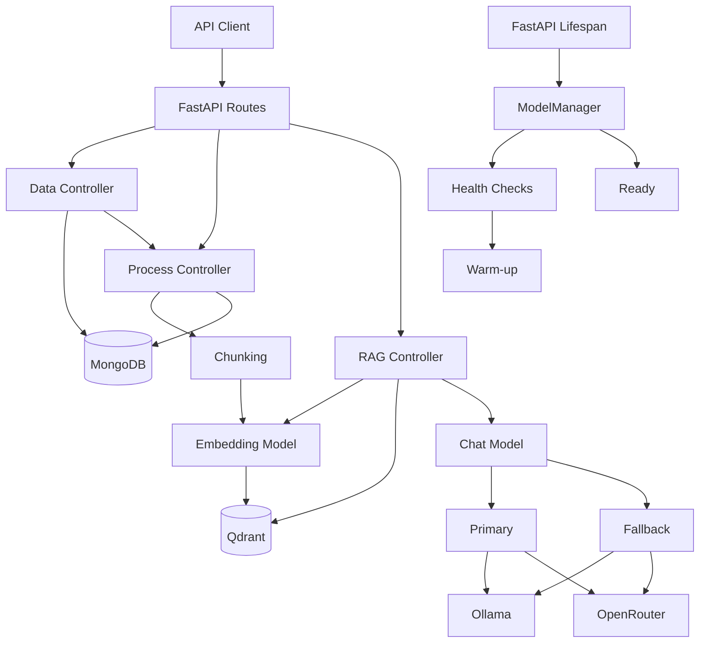

# RAG System OrangeHub

> A production-oriented Retrieval-Augmented Generation backend built with FastAPI, MongoDB, Qdrant, and pluggable LLM/embedding providers.

RAG System OrangeHub provides project-scoped document ingestion, processing, embedding, semantic retrieval, and answer generation through a modular FastAPI architecture.

## Key Features

- Project-scoped document processing using `project_id`.
- PDF and plain-text file ingestion.
- Document validation, processing, and custom chunking.
- Configurable embedding models with Qdrant vector search.
- MongoDB persistence for projects, assets, chunks, and metadata.
- Pluggable Ollama and OpenRouter model providers.
- Primary/fallback chat model with configurable cooldown.
- Startup health checks and model warm-up.
- Reusable model and database clients with graceful shutdown.
- Centralized application logging.
- Unit, API, integration, and end-to-end tests.
- Ruff and pre-commit quality checks.

## Architecture

The application separates API routing, business coordination, infrastructure services, and provider implementations.



### Main Flows

**Document ingestion**

```text
Upload
  ↓
Data Controller
  ↓
File Validation / Processing
  ↓
Chunking
  ↓
Embedding
  ↓
Qdrant + MongoDB
```

**RAG query**

```text
Question
  ↓
RAG Controller
  ↓
Query Embedding
  ↓
Qdrant Search
  ↓
Relevant Chunks
  ↓
Primary Chat → Fallback Chat on failure
  ↓
Answer
```

Models and database clients are initialized during the FastAPI lifespan and reused across requests within the worker process. Startup also performs required health checks and warms the selected chat and embedding models. Shutdown closes MongoDB, model clients, and Qdrant.

## Tech Stack

| Category | Technologies |
|---|---|
| Language | Python 3.11+ |
| API | FastAPI, Uvicorn |
| Configuration | Pydantic, Pydantic Settings |
| LLM | Ollama, OpenRouter |
| Databases | MongoDB, Qdrant |
| Clients | Motor, Qdrant client, Ollama client, OpenAI-compatible client |
| Testing | Pytest, pytest-cov |
| Quality | Ruff, pre-commit |
| Environment | uv, Docker, WSL2 |

## Project Structure

```text
RagSystem_OrangeHub/
├── src/
│   ├── controllers/
│   │   ├── data_controller.py
│   │   ├── process_controller.py
│   │   └── rag_controller.py
│   ├── helpers/
│   │   ├── config.py
│   │   └── exceptions.py
│   ├── models/
│   │   ├── project.py
│   │   ├── asset.py
│   │   ├── chunk.py
│   │   └── enums/
│   ├── routes/
│   │   ├── base.py
│   │   ├── data.py
│   │   └── rag.py
│   ├── services/
│   │   ├── llm/
│   │   │   ├── chat_interface.py
│   │   │   ├── embedding_interface.py
│   │   │   ├── fallback_chat.py
│   │   │   ├── llm_factory.py
│   │   │   ├── llm_manager.py
│   │   │   └── providers/
│   │   │       ├── ollama.py
│   │   │       └── openrouter.py
│   │   └── vectordb/
│   │       ├── vector_db_interface.py
│   │       ├── vectordb_factory.py
│   │       ├── vectordb_manager.py
│   │       └── providers/
│   │           └── qdrant.py
│   ├── utils/
│   │   └── logger.py
│   └── main.py
├── tests/
│   ├── unit/
│   ├── api/
│   ├── integration/
│   └── e2e/
├── .env
├── pyproject.toml
├── uv.lock
└── README.md
```

## Prerequisites

- Python 3.11+
- `uv`
- MongoDB
- Qdrant
- Ollama for local inference
- OpenRouter API key when using OpenRouter

Current local Ollama models:

```text
qwen2.5:3b
bge-m3:latest
```

## Installation & Setup

### 1. Clone and install

```bash
git clone <your-repository-url>
cd RagSystem_OrangeHub
uv sync
```

### 2. Configure `.env`

Create `.env` in the project root and add the required settings below.

### 3. Start infrastructure

Make sure MongoDB, Qdrant, and Ollama are reachable from the configured URLs.

Verify Ollama models:

```bash
ollama list
```

### 4. Run the API

```bash
PYTHONPATH=src uv run uvicorn main:app --host 0.0.0.0 --port 8001
```

API:

```text
http://localhost:8001
```

Swagger UI:

```text
http://localhost:8001/docs
```

## Environment Variables

The application loads configuration from `.env` through Pydantic Settings.

| Variable | Required | Purpose |
|---|---:|---|
| `APP_NAME` | Yes | Application name |
| `APP_VERSION` | Yes | Application version |
| `LOG_LEVEL` | No | Logging level, default `INFO` |
| `FILE_ALLOWED_TYPES` | Yes | Allowed MIME types |
| `FILE_MAX_SIZE` | Yes | Maximum file size in bytes |
| `FILE_DEFAULT_CHUNK_SIZE` | Yes | Default chunk size |
| `MONGODB_URL` | Yes | MongoDB connection URL |
| `MONGODB_DATABASE` | Yes | MongoDB database name |
| `OLLAMA_BASE_URL` | Conditional | Ollama server URL |
| `OPENROUTER_API_KEY` | Conditional | OpenRouter API key |
| `CHAT_MODELS` | Yes | Chat model/provider mapping |
| `CHAT_PRIMARY_MODEL` | Yes | Primary chat model key |
| `CHAT_FALLBACK_MODEL` | Yes | Fallback chat model key |
| `CHAT_FALLBACK_COOLDOWN_SECONDS` | No | Primary retry cooldown, default `60` |
| `EMBEDDING_MODELS` | Yes | Embedding model/provider mapping |
| `EMBEDDING_MODEL` | Yes | Selected embedding model key |
| `MODEL_WARMUP_ENABLED` | No | Startup model warm-up, default `true` |
| `MODEL_WARMUP_TIMEOUT_SECONDS` | No | Warm-up timeout, default `30` |
| `OLLAMA_KEEP_ALIVE` | No | Ollama keep-alive, default `300` |
| `QDRANT_URL` | Yes | Qdrant URL |
| `QDRANT_API_KEY` | No | Qdrant API key |
| `QDRANT_COLLECTION_NAME` | Yes | Vector collection name |
| `QDRANT_VECTOR_SIZE` | Yes | Expected vector dimension |
| `QDRANT_DISTANCE` | Yes | Qdrant distance metric |

Example local configuration:

```env
APP_NAME=RAG System OrangeHub
APP_VERSION=0.1.0
LOG_LEVEL=INFO

MODEL_WARMUP_ENABLED=true
MODEL_WARMUP_TIMEOUT_SECONDS=30
OLLAMA_KEEP_ALIVE=300
CHAT_FALLBACK_COOLDOWN_SECONDS=60

FILE_ALLOWED_TYPES=["application/pdf","text/plain"]
FILE_MAX_SIZE=10485760
FILE_DEFAULT_CHUNK_SIZE=512000

MONGODB_URL=mongodb://localhost:27017
MONGODB_DATABASE=rag-system

OLLAMA_BASE_URL=http://127.0.0.1:11434
OPENROUTER_API_KEY=

CHAT_MODELS={"qwen3":{"provider":"ollama","model":"qwen2.5:3b"},"openrouter_model":{"provider":"openrouter","model":"<openrouter-model-id>"}}
CHAT_PRIMARY_MODEL=qwen3
CHAT_FALLBACK_MODEL=openrouter_model

EMBEDDING_MODELS={"bge-m3":{"provider":"ollama","model":"bge-m3:latest","dimension":1024}}
EMBEDDING_MODEL=bge-m3

QDRANT_URL=http://localhost:6333
QDRANT_API_KEY=
QDRANT_COLLECTION_NAME=<collection-name>
QDRANT_VECTOR_SIZE=1024
QDRANT_DISTANCE=<DistanceMetric-value>
```

Do not commit real secrets to Git.

## API Usage

### Health Check

```bash
curl http://localhost:8001/api/v1/health
```

### Upload a File

Files are uploaded within a project scope:

```bash
curl -X POST \
  "http://localhost:8001/api/v1/data/upload/1" \
  -H "accept: application/json" \
  -F "file=@./document.pdf"
```

### RAG

RAG operations are exposed under:

```text
/api/v1/rag
```

Use Swagger UI for the exact request and response schemas:

```text
http://localhost:8001/docs
```

## Testing

Run the full suite:

```bash
PYTHONPATH=src uv run pytest
```

Coverage:

```bash
PYTHONPATH=src uv run pytest --cov=src --cov-report=term-missing
```

Code quality:

```bash
uv run ruff check src tests
uv run ruff format --check src tests
uv run pre-commit run --all-files
```

## Contributing

- Create a focused feature branch.
- Add or update tests for changed behavior.
- Run tests and quality checks before opening a pull request.
- Keep provider and infrastructure details behind their existing interfaces and factories.

